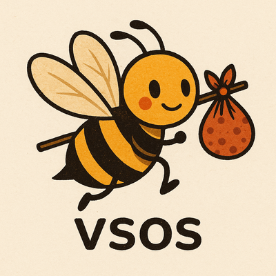

# VSOS: Very Small Operating System



VSOS is a really-basic, portable, hobby operating system written in C.

## Roadmap

- [x] bootstrap with `qemu-system-aarch -M virt`(arm64)
- [x] return from interrupt at EL1 context (arm64)
- [x] console driver (PL011 UART)
- [x] `printk` (arm64)
- [x] cooperative multitasking (arm64)
- [x] system-timer driver (arm64)
- [x] virtual memory at EL1 context (arm64)
- [x] interruptible process sleep (arm64)
- [x] bitmap based allocator
- [x] `SYS_read` (arm64)
- [x] `SYS_write` (arm64)
- [x] initial shell (arm64)
- [X] ELF loader (arm64)
- [X] virtual memory at EL0 context (arm64)
- [X] zygote user process (arm64)
- [ ] `O_NONBLOCK` and `SYS_select` (arm64)
- [ ] block device driver (arm64)
- [ ] file system (arm64)

## Documentation

- **[ARCHITECTURE.md](ARCHITECTURE.md)** - System architecture
- **[DESIGN.md](DESIGN.md)** - System design
- **Build and usage instructions** - See sections below

## Dependencies

On Ubuntu 25.04, we need these dependencies:

```bash
sudo apt install build-essential clang clangd lld llvm ninja-build qemu-system-arm
```

## Building

We use ninja for building. To build the kernel and the shell, type:

```bash
ninja
```

This process produces `kernel.elf`, the kernel. The build process (see [ninja.build](ninja.build))
embeds the shell ELF binary inside the kernel itself.

To remove all built artifacts, use:

```bash
ninja -t clean
```

## Testing

We use `qemu-system-aarch64 -M virt` for testing.

This is the only system supported by VSOS.

```bash
qemu-system-aarch64 \
  -M virt \
  -cpu cortex-a53 \
  -nographic \
  -kernel kernel.elf
```

To investigate errors, obtain more detailed logs using:

```bash
qemu-system-aarch64 \
  -M virt \
  -cpu cortex-a53 \
  -d in_asm,cpu,int,guest_errors -D qemu.log \
  -nographic \
  -kernel kernel.elf
```

This invocation will produce extensive logs inside the `qemu.log` file.

You will frequently need to correlate the logs with the kernel disassembly.

To obtain the kernel disassembly, use:

```bash
llvm-objdump -d --no-show-raw-insn -M no-aliases kernel.elf
```

or:

```bash
readelf -a kernel.elf
```

## License

```
SPDX-License-Identifier: MIT
```

Portions of this code derive from [nuta/operating-system-in-1000-lines](
https://github.com/nuta/operating-system-in-1000-lines).
